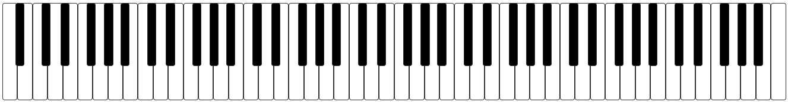

# react-piano-keyboard

A modular, customizable, and accessible React component for rendering a realistic piano keyboard. Supports configurable key range, pressed key color, and full keyboard control. Suitable for use in music education, MIDI tools, and interactive web apps.



## Features
- Realistic piano keyboard layout
- Configurable key range
- Customizable pressed key color
- Responsive and flexible sizing
- Event callbacks for key down/up

## Installation

```sh
npm install react-piano-keyboard
```

## Usage

```jsx
import Keyboard from '../../src/Keyboard';
import '../../src/Keyboard.css';

function App() {

    return (
        <div style={{ padding: 32 }}>
            <h1>react-piano-keyboard Demo</h1>
            <Keyboard
                from={21}
                to={108}
                pressedColor="gray"
            />
        </div>
    );
}

export default App;
```

## Props
| Prop         | Type     | Default   | Description |
|--------------|----------|-----------|-------------|
| `from`       | number   | 36        | Lowest MIDI note (inclusive, min 12) |
| `to`         | number   | 96        | Highest MIDI note (inclusive, max 120) |
| `pressedColor` | string | `#888`    | Color for pressed keys |
| `onKeyDown`  | function |           | Callback: `(note) => {}` when a key is pressed |
| `onKeyUp`    | function |           | Callback: `(note) => {}` when a key is released |

## Ref Methods
- `setKeyPressed(note, isPressed)` — Set a key as pressed or released
- `reset()` — Release all keys

## Example App
A full example is provided in the `example/` directory. To run it:

```sh
cd example
npm install
npm start
```

## License
MIT
