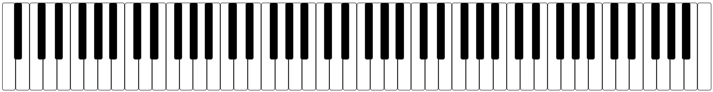

# react-piano-keyboard


A modular, customizable, and accessible React component for rendering a realistic piano keyboard. Supports configurable key range, pressed key color, and full keyboard control. Suitable for use in music education, MIDI tools, and interactive web apps.



## Features
- Realistic piano keyboard layout
- Configurable key range
- Customizable pressed key color
- Responsive and flexible sizing
- Event callbacks for key down/up
- Localized key labels when keys are pressed (optional)
- `KeyboardProgressBar` component for use as a visual progress indicator

## Installation

Since there is no official npm package yet, you need to copy the component locally into your project:

1. Copy the files `src/Keyboard.tsx`, `src/Key.tsx` and `src/Keyboard.css` into your React project
2. Import the component and CSS into your application

## Usage

```jsx
import Keyboard from '../../src/Keyboard';
import '../../src/Keyboard.css';

function App() {

    return (
        <div style={{ padding: 32 }}>
            <h1>react-piano-keyboard Demo</h1>
            <Keyboard
                from={21}
                to={108}
                pressedColor="gray"
            />
        </div>
    );
}

export default App;
```

## Props
| Prop         | Type     | Default   | Description |
|--------------|----------|-----------|-------------|
| `from`       | number   | 36        | Lowest MIDI note (inclusive, min 12) |
| `to`         | number   | 96        | Highest MIDI note (inclusive, max 120) |
| `pressedColor` | string | `#888`    | Color for pressed keys |
| `onKeyDown`  | function |           | Callback: `(note) => {}` when a key is pressed |
| `onKeyUp`    | function |           | Callback: `(note) => {}` when a key is released |
| `language`   | string   |           | When set, pressed keys display their note name in the given language. Supported values: `'de'`, `'en'`, `'fr'`, `'it'`, `'es'`, `'pt'`. |

## Ref Methods
- `setKeyPressed(note, isPressed)` — Set a key as pressed or released
- `reset()` — Release all keys

## KeyboardProgressBar

The package also exports a `KeyboardProgressBar` component that repurposes the keyboard as a read-only progress indicator. Keys are highlighted chromatically from left to right according to a numeric value.

```jsx
import { KeyboardProgressBar } from '../../src';

<KeyboardProgressBar
    value={65}
    max={100}
    from={36}
    to={96}
    color="#4CAF50"
    showPercentage
/>
```

| Prop             | Type    | Default     | Description |
|------------------|---------|-------------|-------------|
| `value`          | number  |             | Current progress value |
| `max`            | number  | `100`       | Maximum value |
| `from`           | number  | `36`        | Start MIDI note |
| `to`             | number  | `96`        | End MIDI note |
| `color`          | string  | `#4CAF50`   | Color for highlighted keys |
| `showPercentage` | boolean | `false`     | Show a percentage label overlay |
| `style`          | object  |             | Inline styles for the wrapper element |

## Example App
An example is provided in the `example/` directory. To run it:

```sh
cd example
npm install
npm run dev
```

## License
MIT
